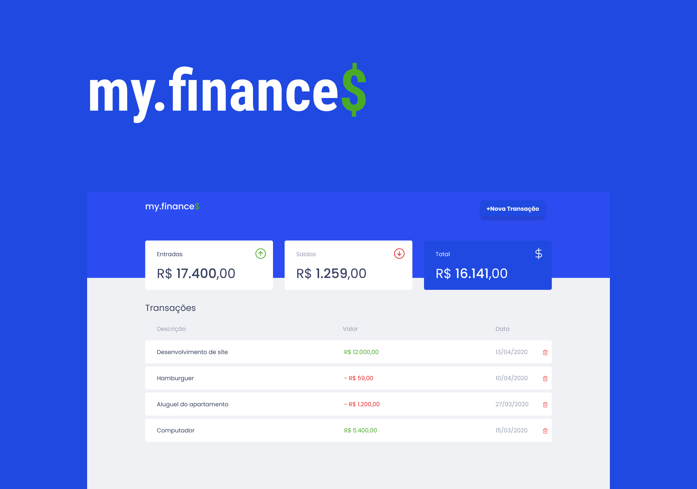

<h1 align="center">
    
</h1>

<h1 align="center">
    
</h1>

<h3 align="center">Você pode acessar o projeto <a href="https://myfinanceswebapp.netlify.app/" target="_blank">clicando aqui</a></h3>

---

# Sobre o projeto
O projeto **My.finance$** é um aplicativo para gerenciamento de finanças pessoais onde é possível cadastrar e excluir transações e as mesmas ficam salvas no localStorage do navegador. Desenvolvido com intuito de praticar o que foi estudado dentro do Discover da **Rocketseat**.

 
---

# Tecnologias

- [Html](https://developer.mozilla.org/pt-BR/docs/Web/HTML)
- [Css](https://developer.mozilla.org/pt-BR/docs/Web/CSS)
- [JavaScript](https://developer.mozilla.org/pt-BR/docs/Web/JavaScript/Guide/Introduction)

---

 Desenvolvido por <a href="https://www.linkedin.com/in/wellingtonrodriguesbr/">Wellington Rodrigues</a> ✌🏼

